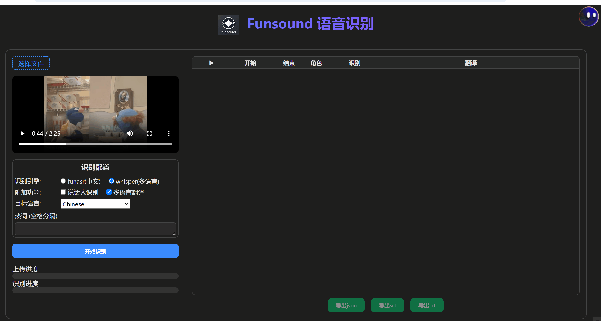
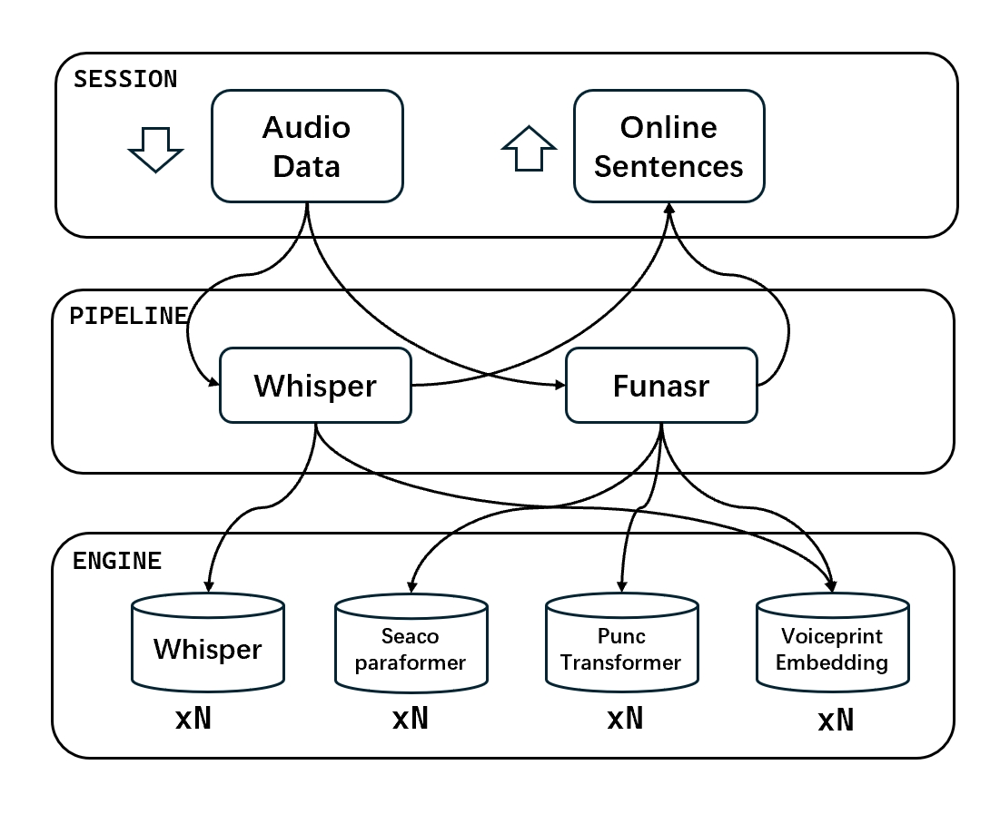

# Funsound 多路语音识别服务搭建


官网：[https://www.funsound.cn](https://www.funsound.cn)

实时语音识别：https://funsound.cn/2pass.html

魔塔：https://modelscope.cn/studios/QuadraV/FunSound

## 1. 特性

Funsound 整合了 **Funasr**, **Whisper**, 和 **Sherpa** 等开源语音识别方案，构建了一个高效的语音识别部署系统。Funsound2 基于 **WebSocket** 协议进行语音上传和实时结果返回。

### 主要特性：
- 面向多路的异步并发服务端设计
- 集成 **Whisper** 和 **Funasr** 等 **SOTA**开源模型
- 支持 **时间戳**、**热词**、**声纹** 和 **多语言翻译** 等功能




### 更新日志
- 2025/04/20 发布初版funsound源码
- 2025/04/25 优化精简代码，去除torch/funasr等冗余库和代码
- 2025/04/29 更新onnxruntime并发机制，构建线程安全复用（⭐）
- 2025/05/29 Funsound3 采用多进程并发 + fastApi异步服务接口，并发速度提升5x以上，私有化部署联系作者
---

## 2. 安装

### Step 1: 创建环境
```bash
conda create -n funsound python=3.10
conda activate funsound
pip install -r requirements.txt
# 安装完毕后，查看funsound.lib是否存在遗漏,同时指定FFMPEG位置
```

### Step 2: 下载模型
```bash
python download_models.py
```

### Step 3: 修改配置
请参考 `funsound.config` 自行修改服务配置。

---

## 3. 启动服务

```bash
python -m funsound.web.server 8800

# 后台运行
# bash launch.sh
# 杀掉后台
# bash launch.sh -k
```

---

## 4. 客户端测试

### Python 客户端
```bash
python client.py # 自行修改ws地址 和 音频路径 进行测试。
```

### 网页客户端
修改 `client.html` 中的 WebSocket 服务地址进行测试。

---

## 5. 高级
Funsound交互逻辑如图：


- **funsound.brain.translator**: 基于大语言模型（LLM）的跨语言翻译
- **funsound.engine**: 并发引擎接口
- **funsound.pipeline**: Funsound 业务接口
- **funsound.web**: Funsound 服务部署

---

## 6. 联系作者

如有问题或建议，请联系：

**邮箱**: [605686962@qq.com](mailto:605686962@qq.com)

